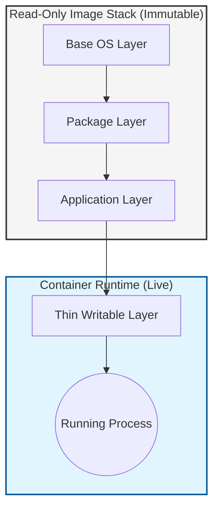
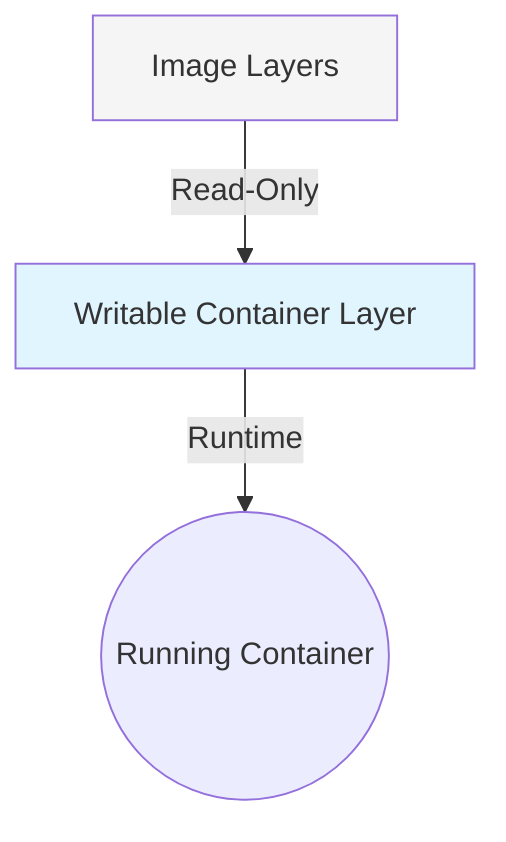
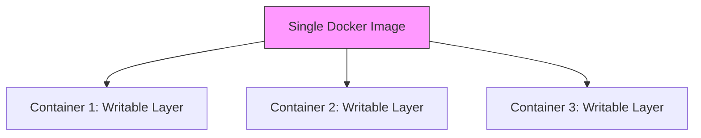
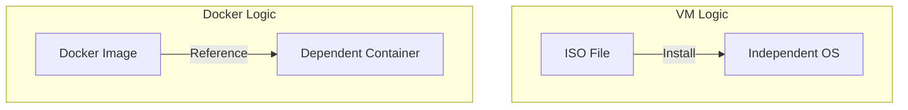

1. Docker Image Layers
A Docker image is built in layers. Each instruction in a Dockerfile (e.g., FROM, RUN, COPY) creates a new immutable (read-only) layer. These layers are cached, making builds incredibly efficient.

2. Creating a Container from an Image
A container is a running instance of an image. When you execute docker run, Docker performs the following steps:

Loads the read-only image layers.

Adds a thin Writable Layer on the very top.

3. Relationship: Shared Foundations
The container depends on the image for its entire lifecycle. While the writable layer is unique to each container, the underlying image layers are shared across all containers created from that image.

Efficiency: 10 containers running from the same image don't take up 10x the disk space.

Safety: If you delete a container, the image remains intact.

Starts the process defined in the image (e.g., CMD or ENTRYPOINT).

4. Analogy: ISO vs. Docker Image
Understanding the difference between an ISO and a Docker image is key to becoming a Docker expert.

Feature,ISO / Virtual Machine,Docker Image / Container
Independence,"Independent: Once installed, the OS no longer needs the ISO.",Dependent: The container always relies on the image layers to exist.
Architecture,A full snapshot copied to a disk.,A live stack of referenced layers.

Key Takeaways
Image = Blueprint: Immutable, layered, and shared.

Container = Instance: The image foundation + a thin writable "delta" layer.

Tied for Life: Unlike ISO-installed systems, containers are always physically related to their parent image structure.

Expert Tip: Use docker diff <container_name> to see exactly what files have been moved into the writable layer since the container started.
